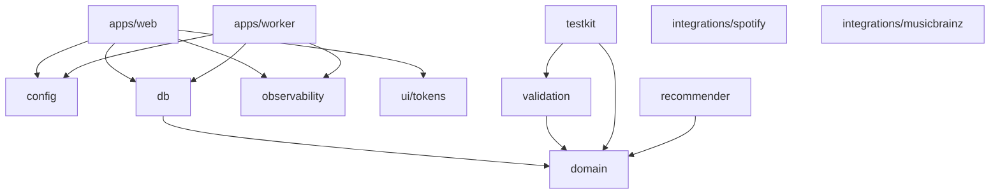

# Package dependency graph

Allowed dependency direction (enforced by `pnpm policy:check` and ESLint;
arrows mean "may import"):

Rules (spec §6.2; ADR 0002/0003):

1. `packages/recommender` and `packages/domain` may never import any
   integration package. Providers are injected behind interfaces defined in
   `packages/recommender`.
2. `@resonance/spotify` may be imported by **nobody** today. Milestone 4 adds
   an explicit allowlist (worker destination jobs, web export routes) via ADR.
3. Raw Spotify payload types never leave `packages/integrations/spotify`;
   only the `ExportResolution` DTO crosses, and only toward export flows.
4. `packages/domain` is framework-free (no Next.js/React imports).
5. Apps depend on packages; packages never depend on apps.

Current real import edges are verified on every `pnpm policy:check` run by
`scripts/verify-policy-boundaries.ts` (rules R1–R4).
